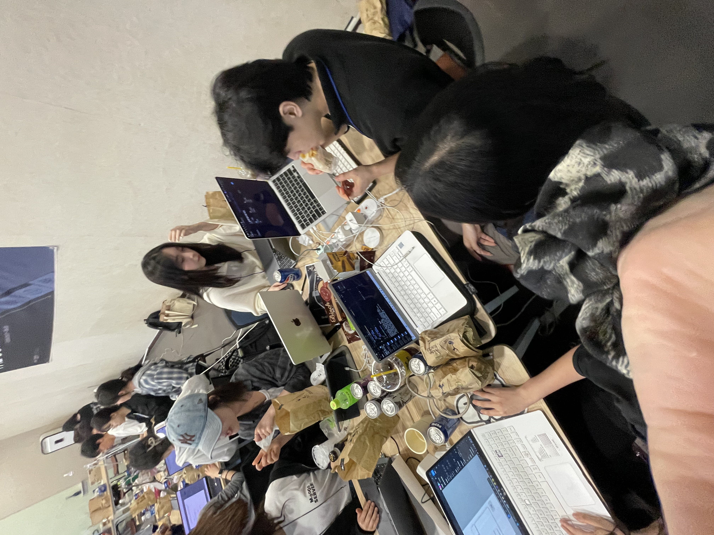

<div align="center">

<h2> 🥔 감자가자 🥔 </h2>
<p>감자머리 전남친한테 물어봐서라도 다시 가고 싶은 장소들을 추천해줘요 🫡</p>

</div>

<h2> 🥔 감자가자 🥔 주요 기능 </h2>

<p> 1️⃣ 군부대 근처 장소 TOP 10  </p>
<p> 2️⃣ 장소 추천을 위한 이지선다 검사 </p>
<p> 3️⃣ 맞춤형 군부대 근처 장소 추천 </p>

<h2> 👥 Team </h2>

<table align="center">
    <tr align="center">
      <td style="min-width: 150px;">
            <a href="">
              
              <br />
              <b>Jeong-Ag</b>
            </a>
        </td>
      <td style="min-width: 150px;">
            <a href="https://github.com/jeonghoon11">
              
              <br />
              <b>jeonghoon11</b>
            </a>
        </td>
      <td style="min-width: 150px;">
            <a href="https://github.com/yeeeww">
              
              <br />
              <b>yeeeww</b>
            </a>
        </td>
              <td style="min-width: 150px;">
            <a href="https://github.com/sndks">
              
              <br />
              <b>yeeeww</b>
            </a>
        </td>
    </tr>
    <tr align="center">
       <td>
            김정은 <br/>
      </td>
       <td>
            장정훈 <br/>
      </td>
       <td>
            김예원 <br/>
      </td>
      <td>
            문혜성 <br/>
      </td>
    </tr>
  	<tr align="center">
       <td>
            리드 <br/>
      </td>
       <td>
            온보딩 페이지 및 모달 구현 <br/>
      </td>
       <td>
           결과 페이지 및 랭킹카드, 칩 구현 <br/>
      </td>
      <td>
           테스트 페이지 및 셀렉트 박스, 버튼 구현  <br/>
      </td>
    </tr>
</table>

<h2> 🛠 기술스택 </h2>

```
- React
- Vite
- yarn
- Emotion
- Axios
```

<br/>

<h2>  📄 컨벤션 및 브랜치 전략 </h2>

<h3> 컨벤션 </h3>

| 커밋 컨벤션 | 용도               |
| ----------- | ------------------ |
| feat        | 기능 추가          |
| refactor    | 코드 변경          |
| fix         | 에러 수정          |
| style       | 디자인 수정        |
| chore       | 프로젝트 설정 관련 |
| docs        | 문서 수정          |

<h3> 브랜치 </h3>

| 브랜치 | 용도           |
| ------ | -------------- |
| main   | 배포 가능 상태 |

<b>브랜치 컨벤션</b> : `${타입}/#${이슈번호}/${기능}`

<br/>

<h2>스웹팟 Before and After</h2>
<h3>Before</h3>

